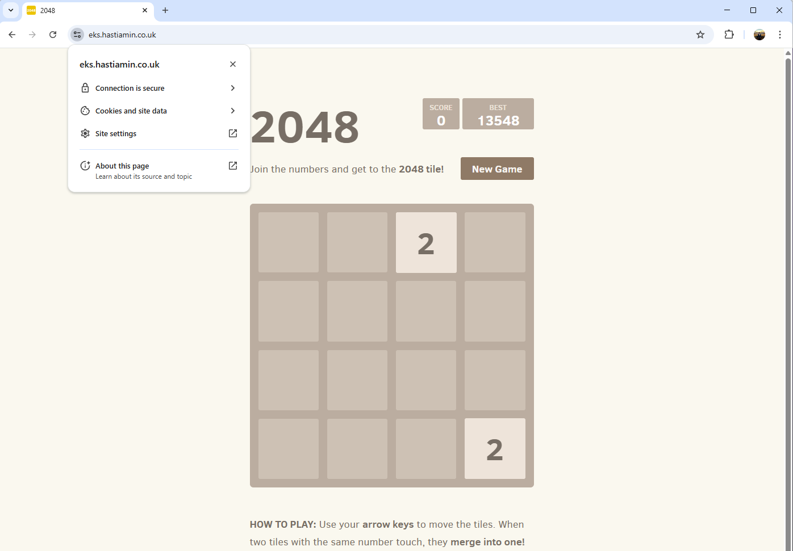
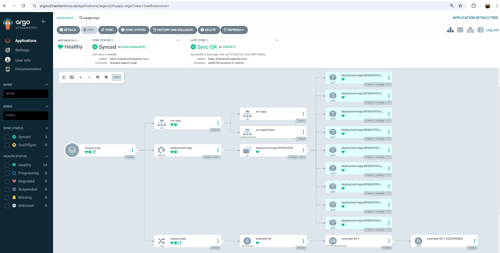
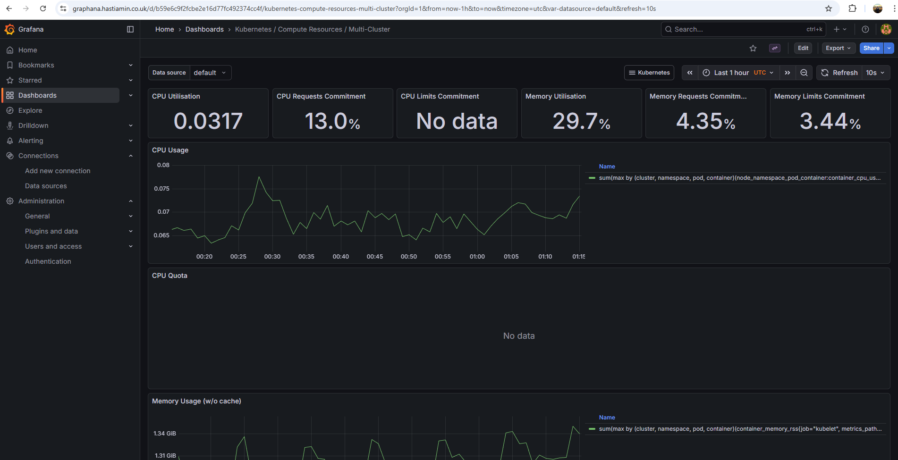
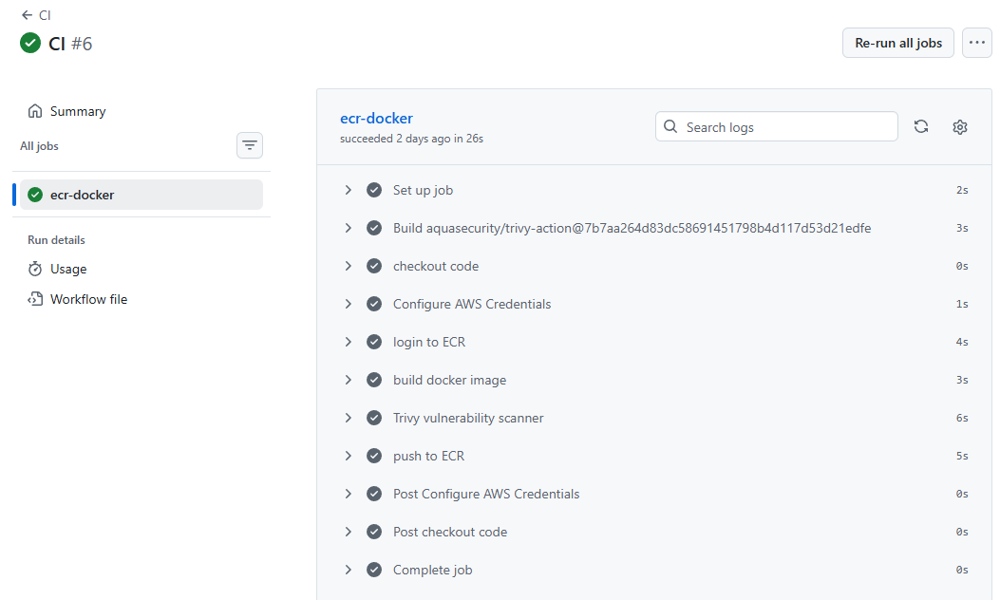
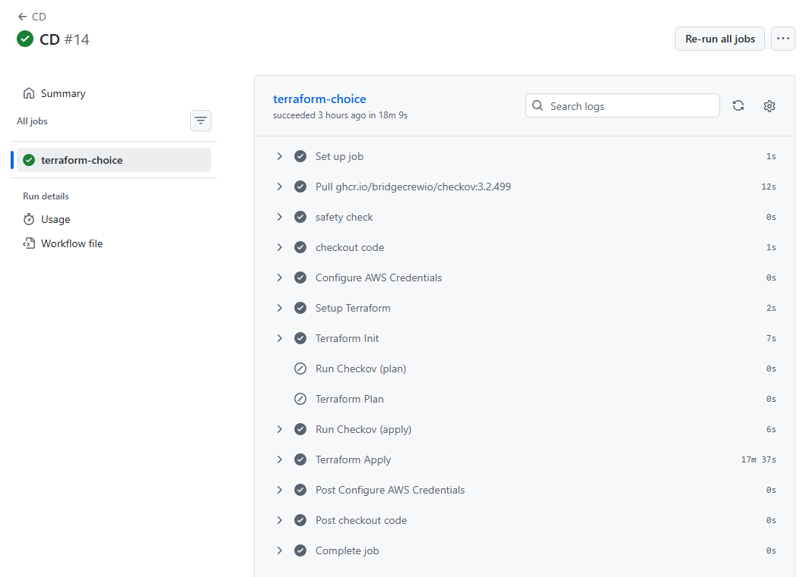
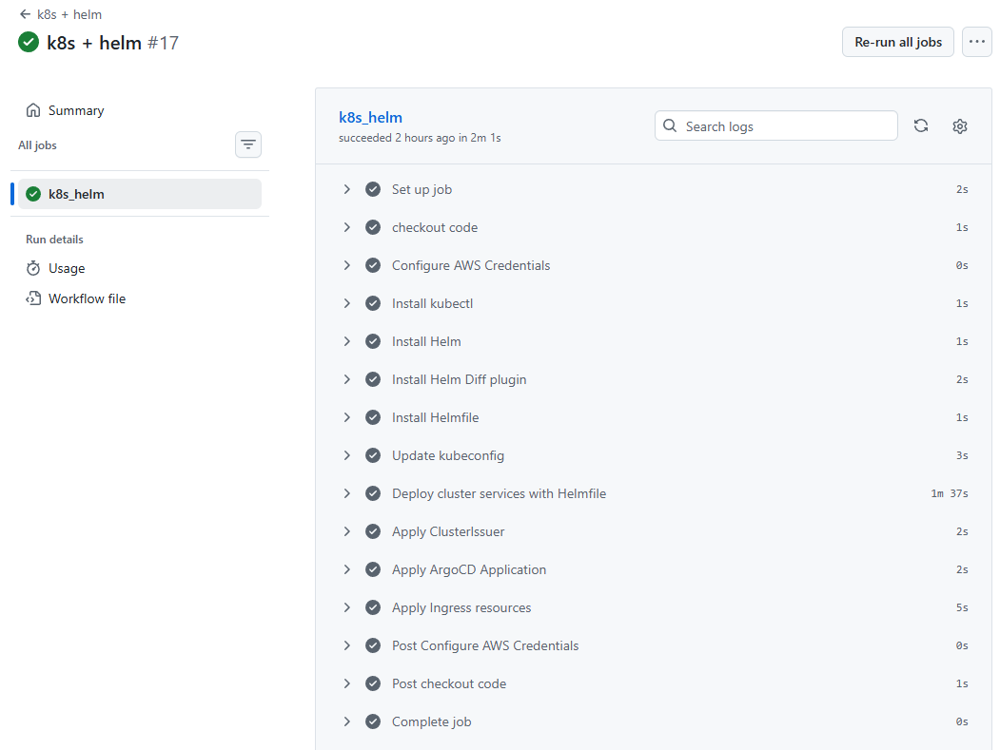
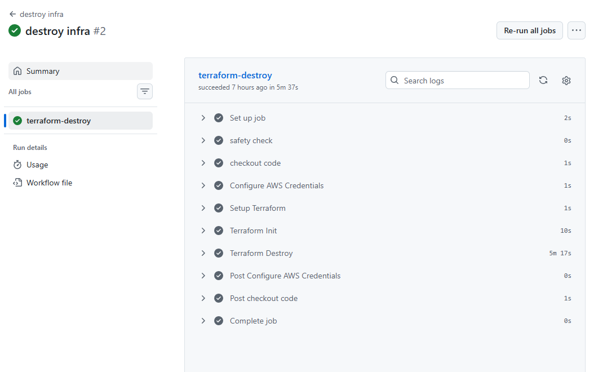

# GitOps AWS EKS Deployment Project

In this project I deploy a containerised app using Docker onto AWS EKS with Infrastructure as Code using Terraform, and automate developer changes using GitHub Actions as my CI/CD. I also use helm charts such as NGINX Ingress Controller, External (Dynamic) DNS for automating DNS records, Cert Manager for automated TLS, ArgoCD for GitOps methodoloy, and Prometheus and Graphana for monitoring and observability.

## Project Overview

This project entails a production ready Kubernetes deployment on AWS EKS with managed infrastructure as code using Terraform and helm charts deployed with Helmfile. The app is a 2048 game which I have dockerised and pushed to AWS ECR, the pods pull this image.

The terraform infrastructure overview:

- Bootstrap folder to manage and spin up ECR for the docker image, S3 bucket for storing the terraform state in a remote backen, and DynamoDB for state locking
- Custom VPC with 3 Availability zones, a public and private subnet in each AZ. Regional NAT gateway, route tables, internet gateway, and VPC flow logs
- EKS cluster with 3 worker nodes, relevant addons and IAM roles
- Pod identity configuration for specific pods to access external AWS resources
- Security groups for node to node traffic on TCP/UDP, cluster to node traffic, and cluster to kubelet traffic
- Modular Terraform code design for reusability and ease of maintenance

The helm charts used were:

- NGINX Ingress Controller: choice of Ingress controller for external traffic coming into the cluster
- External DNS to manage Route 53 records dynamically
- Cert Manager for dynamic and automated TLS certificates
- ArgoCD for a GitOps architecture
- Prometheus and Graphana: observability and monitoring tools, prometheus to scrape metrics and data from the cluster, and graphana to create dashboards based on the prometheus metrics

## Deployed app



## Architecture Diagram


## File Structure

```
eks-project/
├── app
├── infra
│   ├── bootstrap
│   │   ├── main.tf
│   │   ├── modules
│   │   │   ├── dynamodb
│   │   │   │   ├── main.tf
│   │   │   │   └── variables.tf
│   │   │   ├── ecr
│   │   │   │   ├── main.tf
│   │   │   │   └── variables.tf
│   │   │   └── s3
│   │   │       ├── main.tf
│   │   │       └── variables.tf
│   │   ├── provider.tf
│   │   ├── terraform.tfstate
│   │   ├── terraform.tfstate.backup
│   │   └── variables.tf
│   ├── main.tf
│   ├── modules
│   │   ├── eks
│   │   │   ├── main.tf
│   │   │   ├── outputs.tf
│   │   │   └── variables.tf
│   │   ├── pod-identity
│   │   │   ├── main.tf
│   │   │   └── variables.tf
│   │   ├── sg
│   │   │   ├── main.tf
│   │   │   └── variables.tf
│   │   └── vpc
│   │       ├── main.tf
│   │       ├── outputs.tf
│   │       └── variables.tf
│   ├── provider.tf
│   ├── terraform.tfvars
│   └── variables.tf
├── kubernetes
│   ├── argocd-ingress.yaml
│   ├── argocd.yaml
│   ├── charts
│   │   └── app_chart
│   │       ├── Chart.yaml
│   │       ├── charts
│   │       ├── templates
│   │       │   ├── deployment.yaml
│   │       │   ├── ingress.yaml
│   │       │   └── service.yaml
│   │       └── values.yaml
│   ├── clusterissuer.yaml
│   ├── graphana-ingress.yaml
│   ├── helmfile.yaml
│   └── prometheus-ingress.yaml
```

## GitOps Architecture with ArgoCD

The app manifests get deployed via a custom helm chart dynamically through ArgoCD. GitOps is the practice where Git/GitHub is the source of truth for the manifests.

I specify my GitHub repo and the file path to my applications Helm chart, and ArgoCD manages the updates, all I need to do is push updates to Git.

I have configured an Ingress manifest to use a custom domain with TLS encryption (HTTPS) using External DNS and Cert Manager for ArgoCD UI



## Prometheus for scarping metrics from EKS cluster

Prometheus is used as the primary monitoring system for the EKS cluster and deployed workloads. It continuously scrapes metrics from Kubernetes components, nodes, and application pods, storing them as time-series data for observability

In this project, Prometheus is deployed via a Helm chart and configured to automatically discover and scrape metrics from the EKS cluster

I have configured an Ingress manifest to use a custom domain with TLS encryption (HTTPS) using External DNS and Cert Manager for Prometheus UI


## Graphana for making dashboards based on the metrics that prometheus scrapes

Grafana is integrated with Prometheus as a data source and is used to visualise metrics through dashboards. Dashboards display real-time insights such as:

- Node and pod resource usage
- Cluster capacity and health
- Application availability and performance
- Request and error metrics

I have configured an Ingress manifest to use a custom domain with TLS encryption (HTTPS) using External DNS and Cert Manager for Graphana UI



## Pod identity

Pod identity allows specific pods to access external AWS resources. This is adding the pod-identity addon within the cluster then making an IAM role and giving it a policy which has permissions to access specific AWS resources. In my project my external DNS pod needs access to managing AWS Route 53 records so I give the IAM role these policy permissions.

Then I create a pod identity association where I specify the cluster name, the namespace, a service account and also the IAM role ARN. The service account specified here will have the IAM roles to access Route 53, and the external DNS pods will have the service account.

For cert manager I only do http-01 challenge meaning cert manager does not also need access to Route 53, however if I was using dns-01 challenge then I would have to do the same process but for cert manager

## CI/CD Pipelines

I have 5 pipelines:

- CI
- CD
- k8s + helm
- k8s + helm destroy
- destroy infra

CI pipeline: Builds docker image, runs Trivy scanner for image vulnurabilities, if security checks pass then image is pushed to ECR. If security checks are not passed then exit code of 1 is given and the pipeline ends.



CD pipeline: Multi choice pipeline (plan/apply), if user choice is plan then terraform is configured and infrastructure goes through Checkov best practice checks, it will show the errors but continue to show the terraform plan output. If user choice is apply, then terraform is configured and infrastructure goes through Checkov best practices, if errors are found then the pipeline will leave with exit code of 1, if there are no errors then the `terraform apply --auto-approve` command will be ran.



k8s + helm pipeline: This pipeline is ran after the CD pipeline. Kubectl, helm, helm diff, and helmfile are installed. Then the EKS cluster is added to kubectl contexts and all workloads specified in the helmfile are applied (nginx ingress controller, external dns, cert manager, prometheus and graphana). After that the cluster issuer, argocd application, argocd ingress, prometheus ingress, and graphana ingress are applied.



k8s + helm destroy pipeline: This pipeline is applied when you want to begin destroying the infrastructure. This pipeline must be ran before the destroy infra pipeline because the kubernetes workloads sit inside the EKS cluster managed by the infrastructure under terraform control. This pipeline installs kubectl, helm, helm diff, and helmfile are installed. Then the EKS cluster is added to kubectl contexts. All resources within the helmfile are destroyed, the cluster issuer, argocd application, argocd ingress, prometheus ingress, and graphana ingress are deleted. And all external namespaces are also deleted.


destroy infra pipeline: This pipeline is applied after the k8s + helm destroy pipeline because now the workloads should be removed and all that is left is to destroy the underlying infrastructure under terraform control. This pipeline configures terraform and runs the `terraform destroy --auto-approve` command to destroy all of the infrastructure.


