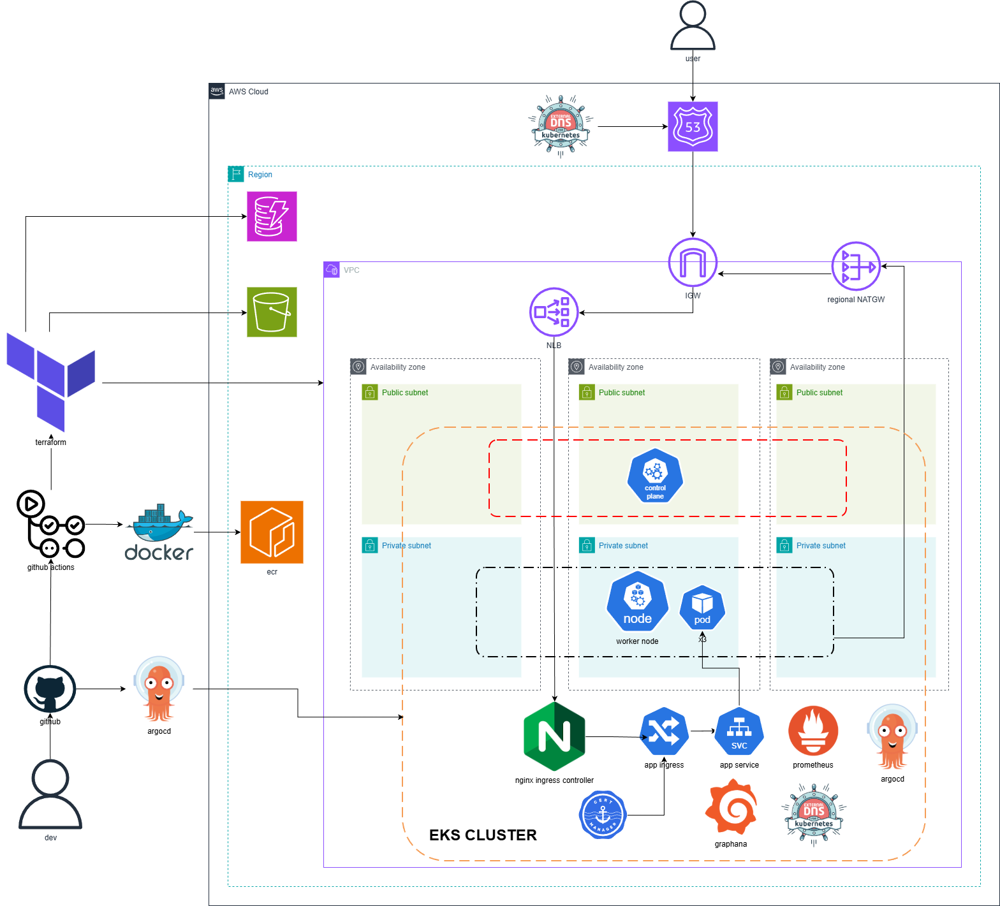

# GitOps EKS Deployment Project

### In this project I deploy a containerised app using Docker onto AWS EKS with Infrastructure as Code using Terraform, and automate developer changes using GitHub Actions as my CI/CD. I also use helm charts such as NGINX Ingress Controller, External (Dynamic) DNS for automating DNS records, Cert Manager for automated TLS, ArgoCD for GitOps methodoloy, and Prometheus and Graphana for monitoring and observability.

## Project Overview

Application containerised using Docker to run consistently in all environments.

Bootstrap Terraform folder to boot up and manage ECR repo, S3 bucket for remote backend, and DynamoDB for state locking

VPC with 3 Availability zones in region eu-west-2, public and private subnets, route tables, regioinal NAT gateway, VPC flow logs.

EKS cluster security groups for:

- Nodes accepting traffic from cluster SG
- kubelet accepting traffic from cluster SG (on port 10250)
- node to node traffic TCP/UDP

NGINX Ingress Controller as choice of Ingress Controller

External DNS for dynamic DNS records for App, Argocd, Prometheus, Graphana.

Cert Manager for automated TLS encryption.

ArgoCD for GitOps driven architecture.

Prometheus and Graphana for monitoring and observability.

Pod Identities for Node to AWS services communication

## Architecture Diagram

